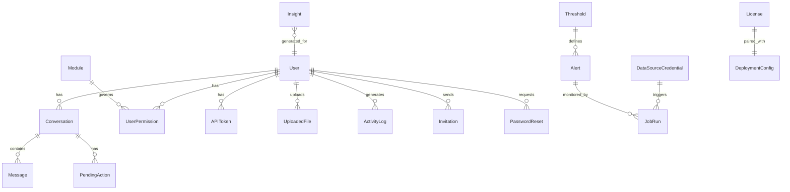

# Database Overview: BI Agent Platform

## Technology

PostgreSQL 16. Accessed via SQLAlchemy 2.0 with asyncpg for fully async query execution. Schema migrations are managed with Alembic.

---

## Entity Relationship Overview

> View this diagram: open the `.mmd` file in [Mermaid Live Editor](https://mermaid.live)

See [docs/diagrams/er-diagram.mmd](docs/diagrams/er-diagram.mmd)

---

## Table Purposes

### Core Identity

| Table | Purpose | Key Relationships |
| ----- | ------- | ----------------- |
| `users` | All accounts: super admin, admin, and regular users. Stores role, activity status, login state. | Parent to conversations, permissions, tokens, files, logs |
| `api_tokens` | Long-lived Bearer tokens for programmatic REST API access. | FK to users |
| `invitations` | Time-limited invitation tokens sent to new users via email. | FK to users (inviter) |
| `password_resets` | Single-use tokens for password reset flows. | FK to users |

### Chat and Agent

| Table | Purpose | Key Relationships |
| ----- | ------- | ----------------- |
| `conversations` | Chat session containers. Holds title, creation time, demo flag. | FK to users. Parent to messages and pending actions. |
| `messages` | Individual turns in a conversation. Stores role (user/assistant), content, and metadata (tools used). | FK to conversations |
| `pending_actions` | HITL approval queue. Each record is one proposed action awaiting approval. | FK to conversations and users |
| `uploaded_files` | Metadata for user-uploaded documents. The actual vectors live in ChromaDB. | FK to users |

### Data Sources and Modules

| Table | Purpose | Key Relationships |
| ----- | ------- | ----------------- |
| `data_source_credentials` | One row per data source integration. Stores AES-256 encrypted credential JSON and connection status. | Used by agent tools and KPI connectors |
| `modules` | Registry of all available integration modules. Seeded on startup. | Parent to user permissions |
| `user_permissions` | Per-user flags for each module. Controls which tools the agent assembles for a given user. | FK to users and modules |

### Monitoring and Insights

| Table | Purpose | Key Relationships |
| ----- | ------- | ----------------- |
| `thresholds` | Metric threshold definitions: which metric, which operator, which value. | FK to alerts |
| `alerts` | Configured alert rules. Links a threshold to notification channels (email, Telegram). | FK to thresholds. Parent to job runs. |
| `job_runs` | Execution log for every monitoring run. Records the metric value fetched, whether a breach occurred, and any error. | FK to alerts and data sources |
| `insights` | AI-generated narrative summaries of recent metric trends. Created by a Celery task on a schedule. | FK to users |

### Configuration

| Table | Purpose | Key Relationships |
| ----- | ------- | ----------------- |
| `ai_settings` | One row per deployment. Stores the configured LLM provider, model, encrypted API key, and behavior settings. | Loaded by the agent on every request |
| `license_model` | One row per deployment. Stores the license JWT. | Validated by LicenseMiddleware |
| `deployment_config` | General deployment settings. | One row per deployment |

### Audit

| Table | Purpose | Key Relationships |
| ----- | ------- | ----------------- |
| `activity_log` | Append-only audit trail. Records significant actions with timestamp, user, action type, and a detail string. | FK to users |

---

## Index Strategy

**High-read paths indexed:**

- `conversations.user_id` and `conversations.created_at` (user conversation list, sorted)
- `messages.conversation_id` (load all messages for a conversation)
- `activity_log.user_id` and `activity_log.created_at` (activity log pagination)
- `pending_actions.conversation_id` and `pending_actions.status` (find open approvals)
- `api_tokens.token_hash` (token authentication lookup on every request)
- `data_source_credentials.source_name` and `is_connected` (connector lookup by tool)

---

## Migration Strategy

Alembic is used for all schema changes. Migration files are numbered sequentially. Each migration is a single logical change (e.g. adding a table, adding a column, adding an index). Production deployments run `alembic upgrade head` as part of the Docker entrypoint before the app starts.

Migration phases in this project:
- 001: Initial schema (users, auth, conversations, data sources)
- 003: Agent tables (messages, pending actions, conversations with demo flag)
- 004: Insights and alerts tables
- 005: Thresholds and job runs
- 006: Telegram configuration columns
- 007: Activity log index improvements

---

## Notes

- All tables use UUID primary keys (generated by the database).
- Timestamps use `created_at` and `updated_at` with timezone-aware UTC values.
- Soft deletes are used for users (via `is_active` flag) to preserve audit trails.
- No foreign key constraints are enforced at the database level for `activity_log` entries, since log records should persist even if the referenced user is deactivated.
