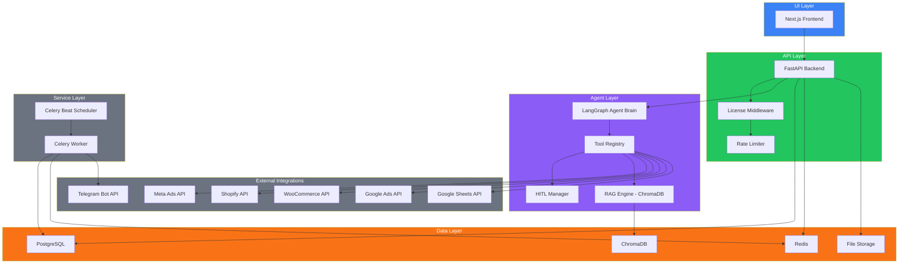
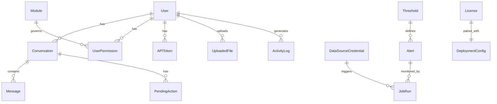
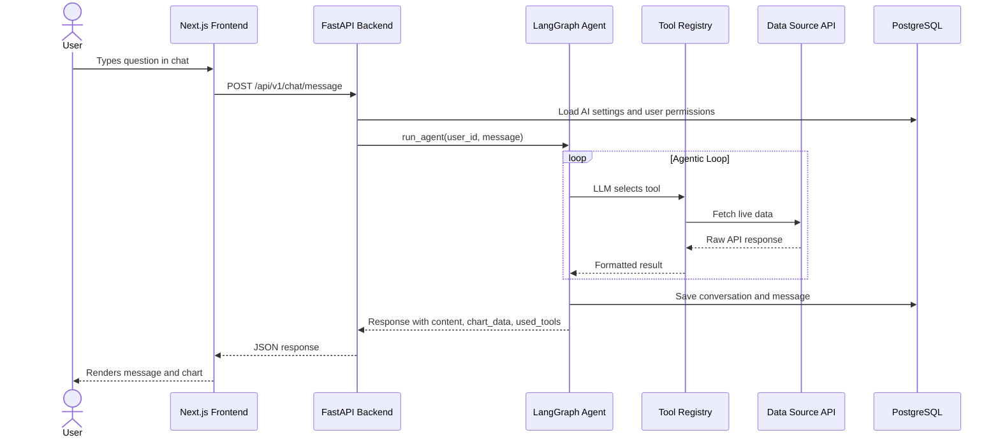

# BI Agent Platform

> An AI-powered business intelligence platform that lets teams ask questions about their business data in plain English and get answers instantly.

The BI Agent Platform connects to your marketing, e-commerce, and database sources and puts a conversational AI layer on top of them. Instead of switching between Meta Ads Manager, Shopify, and spreadsheets, users ask questions in a chat window and the agent fetches the data, runs the analysis, and explains the result. For actions like pausing an ad set or writing to a Google Sheet, the agent asks for approval before doing anything.

> **Portfolio Note:** This is a public showcase repository. It contains architecture documentation, design decisions, and skeleton code structure. The full production implementation is proprietary. The engineering depth, system design, and problem-solving approach demonstrated here reflect the real project.

---

[](https://app.url)

> **Demo credentials** — Username: `admin` · Password: `admin123`

---

## Table of Contents

- [Problem Statement](#problem-statement)
- [Solution Overview](#solution-overview)
- [Architecture Overview](#architecture-overview)
- [Features](#features)
- [Technology Stack](#technology-stack)
- [Database Design](#database-design)
- [User Roles and Permissions](#user-roles-and-permissions)
- [System Design Decisions](#system-design-decisions)
- [API Overview](#api-overview)
- [Project Structure](#project-structure)
- [Deployment Architecture](#deployment-architecture)
- [Development Journey](#development-journey)
- [Technical Skills Demonstrated](#technical-skills-demonstrated)
- [Project Metrics](#project-metrics)
- [Screenshots](#screenshots)
- [Case Study](#case-study)
- [Setup](#setup-development-reference-only)
- [License](#license)

---

## Problem Statement

Marketing and e-commerce teams track data across many platforms. A business owner might check Meta Ads for ROAS, then open Shopify for order volume, then pull a database report, then check a Google Sheet someone updated manually. Each tool has its own interface. Spotting a problem, or understanding what caused it, means pulling data from three or four places and doing the math yourself.

There is no unified place to ask "why did revenue drop this week?" and get a real answer backed by live data.

## Solution Overview

The BI Agent Platform gives teams a single chat interface connected to all their data sources. The AI agent knows how to query Meta Ads, Shopify, WooCommerce, PostgreSQL, MySQL, and Google Sheets. When a user asks a question, the agent picks the right tools, fetches the data, and writes a plain-language answer. Charts are rendered inline. Destructive actions require a one-click approval before anything changes. Scheduled monitoring runs in the background and sends alerts when metrics cross thresholds.

---

## Architecture Overview

The platform is a decoupled three-tier system: a Next.js frontend, a FastAPI async backend, and a PostgreSQL database. Background processing runs in Celery workers. A vector database (ChromaDB) handles file-based semantic search. The AI agent runs inside the backend request cycle using LangGraph for multi-step tool orchestration.

### System Diagram

> View this diagram: open the `.mmd` file in [Mermaid Live Editor](https://mermaid.live)

See [docs/diagrams/architecture.mmd](docs/diagrams/architecture.mmd)



### Component Breakdown

| Component        | Responsibility                                                          |
| ---------------- | ----------------------------------------------------------------------- |
| Next.js Frontend | Chat UI, KPI dashboard, admin panels, real-time message streaming       |
| FastAPI Backend  | REST API, agent orchestration, auth, rate limiting                      |
| LangGraph Agent  | Multi-step reasoning loop, tool selection, response synthesis           |
| Tool Registry    | Per-user module-gated tool set for data source access                   |
| HITL Manager     | Queues destructive actions for human approval before execution          |
| Celery Worker    | Background tasks: insight generation, alert monitoring, report delivery |
| Celery Beat      | Cron-based scheduling for periodic jobs                                 |
| ChromaDB         | Vector store for semantic search over uploaded files                    |
| PostgreSQL       | Primary relational data store                                           |
| Redis            | Session cache, rate limit counters, license status cache                |

---

## Features

### Conversational AI Agent

**Purpose:** Lets users ask business questions in plain English and get data-backed answers.

**User Workflow:**

1. User opens the chat and types a question ("What was my ROAS this week?")
2. Agent selects the right data source tool
3. Agent fetches live data from the connected platform
4. Agent writes a clear answer with numbers formatted for business reading
5. If a chart helps, the agent renders it inline in the chat

**Business Value:** Replaces the manual process of logging into multiple platforms and pulling data. Analysts and non-technical managers can get answers without SQL knowledge.

**Technical Summary:** LangGraph manages a multi-step agentic loop. Each iteration the LLM decides whether to call a tool or produce a final answer. Tool results feed back into the message context. The loop terminates when the LLM returns a response with no tool calls, or when the configured iteration limit is reached.

---

### Human-in-the-Loop (HITL) Approval

**Purpose:** Prevents the AI from taking irreversible actions without a human confirming first.

**User Workflow:**

1. User asks the agent to take an action ("Pause the underperforming ad set")
2. Agent identifies this as a destructive action and creates a pending approval request
3. A confirmation card appears in the chat with the proposed action and a one-click Approve/Reject button
4. If approved, the action executes. If rejected, nothing changes.

**Business Value:** Gives teams the speed of AI automation with the safety of human oversight. Suitable for businesses where budget changes or ad pauses carry financial risk.

**Technical Summary:** Tools that perform write operations return a `hitl_required` signal instead of executing directly. The backend creates a `PendingAction` record. The frontend renders an approval card tied to that record. Approval endpoints execute the deferred action.

---

### KPI Dashboard

**Purpose:** Shows a live overview of key business metrics in one screen.

**User Workflow:**

1. Admin connects data sources during onboarding
2. The dashboard auto-populates with metric cards from connected sources
3. Users can select time ranges and drill into chart details
4. Metric cards highlight changes vs. the previous period

**Business Value:** Replaces manual reporting spreadsheets with a real-time visual overview.

**Technical Summary:** KPI values are fetched from module-specific service classes. Each connector implements a standard KPI interface. The frontend renders metric cards and Plotly charts from normalized response shapes.

---

### Automated Alerts and Monitoring

**Purpose:** Notifies the team when a metric goes outside a set range, without anyone having to check manually.

**User Workflow:**

1. Admin sets a threshold (e.g. ROAS drops below 2.0)
2. Celery Beat triggers a monitoring job on a schedule
3. The job fetches the current metric value from the connected source
4. If the threshold is breached, the system sends an alert via email and Telegram

**Business Value:** Teams react to problems faster. No one needs to watch a dashboard all day.

**Technical Summary:** Thresholds are stored per-metric with comparison operators. A Celery periodic task evaluates them against live data. Notifications are dispatched through an async notifier that handles both email (SMTP) and Telegram (Bot API).

---

### Scheduled Reports

**Purpose:** Delivers a weekly business summary automatically to the team.

**User Workflow:**

1. Admin configures the report schedule and recipient list
2. Each week, Celery generates a report with charts and KPI tables
3. Report is emailed as a PDF attachment and optionally pushed to Telegram

**Business Value:** Keeps stakeholders informed without anyone preparing the report manually.

**Technical Summary:** Reports are rendered with Weasyprint from Jinja2 HTML templates. Charts are rendered to PNG with Plotly/Kaleido and embedded in the PDF. Delivery is handled by the async SMTP email module and Telegram bot.

---

### File Upload and RAG Search

**Purpose:** Lets users upload documents (PDFs, spreadsheets, reports) and ask questions about them.

**User Workflow:**

1. User uploads a file (PDF, CSV, Excel, DOCX, TXT)
2. The system extracts and chunks the text, then stores embeddings in ChromaDB
3. In chat, the user asks a question about the document
4. The agent retrieves the most relevant chunks and uses them to answer

**Business Value:** Makes static reports and documents queryable without any manual data entry.

**Technical Summary:** Documents are parsed by file type (PyMuPDF for PDF, openpyxl for Excel, python-docx for DOCX). Text is chunked and embedded. ChromaDB stores vectors per user ID scope. The `query_uploaded_files` tool performs a semantic similarity search at query time.

---

### Multi-Source Data Connectors

**Purpose:** Connects the platform to the user's existing data platforms via API.

**Supported Sources:**

- Meta Ads (campaigns, ROAS, spend, CTR, ad set management)
- Shopify (orders, revenue, AOV, inventory)
- WooCommerce (orders, revenue)
- PostgreSQL (natural language to SQL)
- MySQL (natural language to SQL)
- Google Sheets (read and write)
- Google Ads (in progress)

**Technical Summary:** Each connector is an independent module. Credentials are stored encrypted (AES-256) in the database. Connectors are enabled per-license and gated per-user through the permissions system. The natural language to SQL flow uses the configured LLM to generate a SELECT query, then validates it against an allowlist before execution.

---

### Telegram Bot Integration

**Purpose:** Lets users interact with the platform and receive alerts through Telegram.

**Capabilities:**

- Receive threshold alerts in a Telegram chat
- Receive weekly report summaries
- Interact with the AI agent via Telegram messages

**Technical Summary:** The bot uses the Telegram Bot API via webhooks. The webhook endpoint is registered automatically on startup if a bot token is configured. Incoming messages are routed to the same agent brain as the web chat.

---

### License System

**Purpose:** Controls which deployments of the platform are authorized and which modules are active.

**Technical Summary:** The license system is proprietary and not included in this public version. It enforces deployment authorization at the middleware level.

---

### User and Team Management

**Purpose:** Admins can invite team members, assign roles, and control which data sources each person can access.

**User Workflow:**

1. Admin sends an invitation email to a team member
2. Invitee accepts the invitation and sets a password
3. Admin assigns module permissions (which data sources the user can query in chat)
4. User logs in and sees only the tools they are permitted to use

**Technical Summary:** Invitations are time-limited tokens. Role-based access control governs endpoint access. Module permissions are checked at tool-assembly time before each agent run.

---

## Technology Stack

> View this diagram: open the `.mmd` file in [Mermaid Live Editor](https://mermaid.live)

See [docs/diagrams/tech-stack.mmd](docs/diagrams/tech-stack.mmd)

| Layer      | Technology                                  | Purpose                                                 |
| ---------- | ------------------------------------------- | ------------------------------------------------------- |
| Frontend   | Next.js 14 (React 18, TypeScript)           | Server-rendered UI with App Router, streaming-friendly  |
| Styling    | Tailwind CSS                                | Utility-first styling without a heavy component library |
| Charts     | Plotly.js                                   | Interactive charts rendered from agent-generated JSON   |
| Backend    | FastAPI (Python 3.12, asyncio)              | High-performance async API, built-in OpenAPI docs       |
| Agent      | LangGraph + LangChain                       | Multi-step agent reasoning loop with tool use           |
| AI Models  | Anthropic Claude, OpenAI GPT                | Configurable LLM backend per deployment                 |
| Database   | PostgreSQL 16                               | Relational store for all application data               |
| Vector DB  | ChromaDB                                    | Embedding storage for file-based RAG                    |
| Cache      | Redis 7                                     | Rate limiting, license cache, session data              |
| Queue      | Celery + Redis                              | Background task processing                              |
| Scheduler  | Celery Beat                                 | Periodic jobs for alerts and reports                    |
| Auth       | JWT (RS256 for license, HS256 for sessions) | Short-lived access tokens with refresh token rotation   |
| Encryption | AES-256 (Fernet)                            | Encrypts all stored third-party credentials             |
| Proxy      | Nginx                                       | TLS termination, routing, static file serving           |
| Containers | Docker + Docker Compose                     | Consistent local and production environments            |
| Monitoring | Sentry                                      | Error tracking in production                            |

---

## Database Design

### Entity Overview

> View this diagram: open the `.mmd` file in [Mermaid Live Editor](https://mermaid.live)

See [docs/diagrams/er-diagram.mmd](docs/diagrams/er-diagram.mmd)



### Table Purposes

| Table                   | Purpose                                               | Relationships                            |
| ----------------------- | ----------------------------------------------------- | ---------------------------------------- |
| users                   | All user accounts (super admin, admin, regular users) | FK to conversations, permissions, tokens |
| conversations           | Chat session containers                               | FK to messages, pending actions          |
| messages                | Individual chat turns (user and assistant)            | FK to conversations                      |
| pending_actions         | HITL approval queue                                   | FK to conversations and users            |
| data_source_credentials | Encrypted third-party API credentials                 | Central store for all connectors         |
| modules                 | Registry of available data source modules             | FK to user permissions                   |
| user_permissions        | Per-user access rights for each module                | FK to users and modules                  |
| alerts                  | Configured metric thresholds and notification rules   | Evaluated by monitoring tasks            |
| thresholds              | Numeric limits per metric and data source             | FK to alerts                             |
| insights                | AI-generated periodic insights                        | Generated by Celery tasks                |
| job_runs                | Execution log for background jobs                     | FK to data sources and alerts            |
| uploaded_files          | Metadata for user-uploaded documents                  | FK to users                              |
| api_tokens              | Long-lived tokens for REST API access                 | FK to users                              |
| activity_log            | Audit trail of user and system actions                | FK to users                              |
| invitations             | Pending user invitations                              | FK to users (inviter)                    |
| password_resets         | Time-limited password reset tokens                    | FK to users                              |
| ai_settings             | LLM configuration (provider, model, key)              | One record per deployment                |
| license_model           | Active license JWT and metadata                       | One record per deployment                |
| deployment_config       | Deployment-level settings                             | One record per deployment                |

---

## User Roles and Permissions

| Role        | Description                              | Key Permissions                                                       |
| ----------- | ---------------------------------------- | --------------------------------------------------------------------- |
| Super Admin | Platform operator. Set by the developer. | Manage all deployments, view all clients, issue licenses              |
| Admin       | Client workspace administrator.          | Connect data sources, invite users, configure AI, manage alerts       |
| Manager     | Senior team member.                      | Run reports, view full dashboard, use all permitted data source tools |
| Viewer      | Read-only team member.                   | Chat with agent, view dashboard and reports                           |

Data source access is controlled separately from roles. An admin assigns each user permission to specific modules (e.g. a marketing manager gets Meta Ads access, a finance manager gets database access).

---

## System Design Decisions

### Design Patterns Used

- **Service Layer:** Each data source module exposes a consistent connector interface. The agent tool registry uses this interface to build tool lists without knowing connector internals.
- **Repository Pattern:** Database access goes through SQLAlchemy async sessions passed via dependency injection. No direct ORM calls in route handlers.
- **LangGraph Agentic Loop:** The agent state machine handles multi-step tool use cleanly. Each iteration is observable (logged tools used), controllable (max iterations), and interruptible (HITL signal breaks the loop).
- **HITL as a First-Class Pattern:** Destructive tools never execute directly. They return a signal that becomes a database record. The frontend renders the approval card. This separation keeps the agent stateless about approvals.
- **LIFO Middleware Stack:** FastAPI middleware is applied in reverse order. Rate limiting wraps license enforcement, which wraps CORS. This order matters for performance (rate limit rejects before license check).

### Security Approach

Authentication uses short-lived JWT access tokens (15 minutes) with longer-lived refresh tokens (7 days). API token authentication supports long-lived tokens (90 days) for programmatic access. All stored third-party credentials are encrypted at rest with AES-256. The license system enforces deployment authorization at the middleware level. SQL queries generated by the AI agent are validated through a static analysis pass before execution. Row limits are injected into all generated queries.

### Scalability Approach

The backend is stateless. Horizontal scaling adds more FastAPI instances behind the Nginx load balancer. Celery workers scale independently for background task throughput. Redis holds all shared state (caches, rate counters) so workers do not need sticky sessions. ChromaDB runs as a separate service and can be replaced with a managed vector database for larger deployments.

---

## API Overview

> View this diagram: open the `.mmd` file in [Mermaid Live Editor](https://mermaid.live)

See [docs/diagrams/feature-flow.mmd](docs/diagrams/feature-flow.mmd)



### Endpoint Categories

| Category       | Purpose                                                  | Auth Required |
| -------------- | -------------------------------------------------------- | ------------- |
| `/auth`        | Login, refresh, logout, password reset                   | Partial       |
| `/chat`        | Send messages, load conversation history, HITL approvals | Yes           |
| `/kpi`         | KPI metric cards and chart data                          | Yes           |
| `/insights`    | AI-generated periodic insights                           | Yes           |
| `/alerts`      | Alert configuration and triggered alert history          | Yes           |
| `/reports`     | Scheduled report management and download                 | Yes           |
| `/files`       | File upload, list, delete for RAG                        | Yes           |
| `/users`       | User management, invitations                             | Admin         |
| `/admin`       | Data source configuration, AI settings, module control   | Admin         |
| `/super_admin` | Multi-tenant management, license admin                   | Super Admin   |
| `/activity`    | Audit log viewer                                         | Admin         |
| `/profile`     | User profile and API token management                    | Yes           |
| `/telegram`    | Telegram webhook receiver                                | Signed        |
| `/public`      | External REST API for third-party integrations           | API Token     |
| `/health`      | Service health check                                     | No            |

---

## Project Structure

```
bi-agent-public/
├── README.md                    You are here
├── ARCHITECTURE.md              Deep technical architecture
├── FEATURES.md                  Full feature documentation
├── DATABASE_OVERVIEW.md         Schema and data model
├── DEPLOYMENT_OVERVIEW.md       Infrastructure and deployment
├── SECURITY_OVERVIEW.md         Security model
├── CASE_STUDY.md                Client-facing project story
├── .env.example                 Environment variable template
├── src/
│   ├── backend/
│   │   ├── main.py              FastAPI app entry point
│   │   ├── requirements.txt     Python dependencies
│   │   └── app/
│   │       ├── agent/           LangGraph agent, tools, HITL, RAG, memory
│   │       ├── api/v1/          REST API route handlers (16 modules)
│   │       ├── core/            Config, DB, security, license, middleware
│   │       ├── models/          SQLAlchemy ORM models (19 tables)
│   │       ├── schemas/         Pydantic request and response schemas
│   │       ├── modules/         Data source connectors (9 integrations)
│   │       └── tasks/           Celery background tasks
│   └── frontend/
│       ├── app/                 Next.js App Router pages
│       ├── components/          Shared UI components
│       └── lib/                 API client utilities
├── docs/
│   ├── diagrams/                Mermaid source files (.mmd)
│   └── screenshots/             Add your screenshots here
└── LICENSE
```

---

## Deployment Architecture

```
Internet
    |
    v
[Nginx — TLS, Routing]
    |
    +-------> /api  --> [FastAPI Backend :8000]
    |                         |
    +-------> /      --> [Next.js Frontend :3000]

[FastAPI Backend]
    |
    +---> [PostgreSQL :5432]
    +---> [Redis :6379]
    +---> [ChromaDB :8001]
    +---> [Celery Worker] (background tasks)
    +---> [Celery Beat]   (scheduler)
```

| Environment | Stack                                 | Purpose                               |
| ----------- | ------------------------------------- | ------------------------------------- |
| Development | Docker Compose on local machine       | Fast iteration, hot reload            |
| Staging     | Docker Compose on VPS, preview domain | Client review, pre-production testing |
| Production  | Docker Compose on VPS, client domain  | Live client deployment                |

---

## Development Journey

### Key Challenges Solved

- **Natural language to safe SQL:** The agent generates SQL from user questions, but generated SQL can be arbitrary. The solution was a two-pass approach: a static analysis validator checks for disallowed operations before execution, and a row limit is injected regardless of what the LLM produced. This keeps database tools useful while preventing abuse.

- **HITL inside a streaming agent loop:** Integrating approval checkpoints into an async LangGraph loop required a clean signal protocol. Tools that need approval return a structured signal object instead of executing. The loop detects the signal, persists the pending action, and halts, letting the frontend take over.

- **Credential security for multi-source connections:** Each data source stores different credential shapes (API keys, OAuth tokens, database passwords). A single encrypted JSON blob approach was chosen over per-field encryption. AES-256 with a deployment-specific key means credentials are safe at rest and recoverable only on the same deployment.

- **Celery + async FastAPI coexistence:** Celery uses synchronous workers while the FastAPI backend is fully async. The integration point needed careful management of database session creation to avoid mixing sync and async SQLAlchemy contexts.

- **License enforcement without slowing down requests:** License validation on every request would hit the database on every call. A Redis cache with a one-hour TTL keeps the license status in memory. The middleware reads from cache and only falls back to the database when the cache is cold.

### Architectural Decisions

- **LangGraph over a raw LLM loop:** A custom while-loop for tool use works but is hard to debug and extend. LangGraph provides a structured state machine with built-in observability hooks. The tradeoff is added dependency complexity. For a product with ongoing development, the structure was worth the cost.

- **Celery over FastAPI background tasks:** FastAPI BackgroundTasks are fire-and-forget within a single process. For scheduled monitoring (alerts, reports) that needs reliable retries, a persistent queue is necessary. Celery with Redis gives retry logic, visibility into task state, and separation from the web process.

- **Per-deployment Docker Compose over a cloud-native multi-tenant architecture:** The target market is small to medium businesses buying a self-hosted tool. A full Kubernetes multi-tenant setup would be overengineered and expensive to support. Single-tenant Docker Compose deployments keep operational complexity low while still delivering isolation between clients.

---

## Technical Skills Demonstrated

- **Backend:** Async Python (FastAPI, SQLAlchemy 2.0, asyncpg), Celery task queues, REST API design, JWT authentication, Alembic migrations
- **AI Engineering:** LangGraph multi-step agent design, LangChain tool use, RAG with ChromaDB, natural language to SQL, demo mode data simulation
- **Frontend:** Next.js 14 App Router, TypeScript, Tailwind CSS, Plotly chart rendering, streaming-compatible API client
- **Database:** PostgreSQL schema design, async ORM patterns, indexing strategy, AES-256 credential encryption
- **Architecture:** Decoupled service design, HITL pattern, module registry, license middleware, LIFO middleware ordering
- **DevOps:** Docker Compose multi-service orchestration, Nginx reverse proxy, health checks, volume management
- **Security:** Short-lived JWT with refresh tokens, AES-256 at-rest encryption, SQL injection prevention via static analysis, rate limiting, RBAC
- **Integrations:** Meta Ads Graph API, Shopify Admin API, WooCommerce REST API, Google Sheets API, Telegram Bot API

---

## Project Metrics

| Metric                 | Value |
| ---------------------- | ----- |
| Total backend modules  | 16    |
| API endpoint groups    | 15    |
| Database tables        | 19    |
| Data source connectors | 9     |
| Major features         | 10    |
| Background task types  | 4     |
| Estimated complexity   | High  |

---

## Screenshots

> Live demo available on request. Screenshots provided during private demo session.

| Screen         | Description                                                                         |
| -------------- | ----------------------------------------------------------------------------------- |
| Chat Interface | Conversational AI with inline charts, HITL approval cards, and tool call indicators |
| KPI Dashboard  | Metric cards showing ROAS, revenue, orders, and spend across connected sources      |
| Admin Panel    | Data source connection forms, AI settings, module enable/disable toggles            |
| Alert Config   | Threshold builder with metric selector, operator, and notification channel picker   |
| File Upload    | Document upload with processing status and chat integration                         |

---

## Case Study

> See [CASE_STUDY.md](CASE_STUDY.md) for the full project story: the problem, approach, architecture decisions, and outcomes.

---

## Setup (Development Reference Only)

> This public version contains skeleton code and is **not runnable**.
> Contact me for a private demo or to discuss the full implementation.

### Prerequisites

- Docker and Docker Compose
- Node.js 20 (for frontend development)
- Python 3.12 (for backend development)

### Environment Variables

```env
# Copy .env.example and fill in your values
DATABASE_URL=YOUR_VALUE_HERE
APP_SECRET_KEY=YOUR_VALUE_HERE
ENCRYPTION_KEY=YOUR_VALUE_HERE
LICENSE_PUBLIC_KEY=YOUR_VALUE_HERE
```

---

## License

This repository is published for **portfolio and demonstration purposes only**.
All code is skeleton/placeholder and does not represent the production implementation.
All proprietary business logic and algorithms are retained by the author.

Copyright 2026 Abu Salah Mohammad Asif. All rights reserved.
